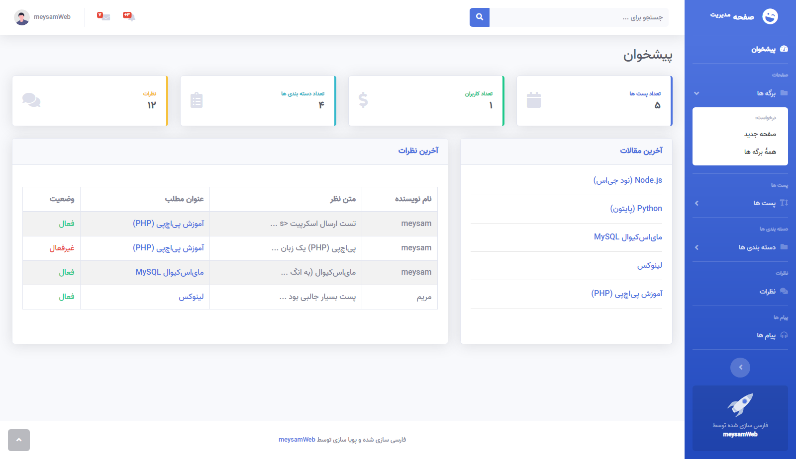
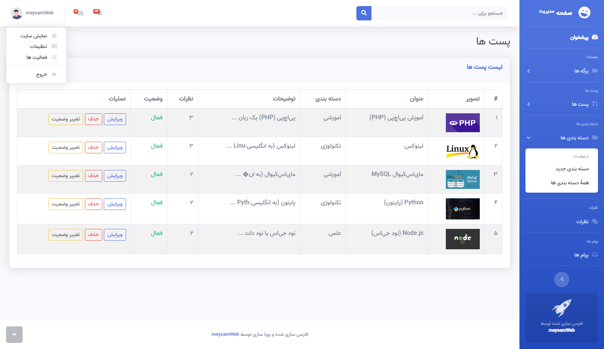
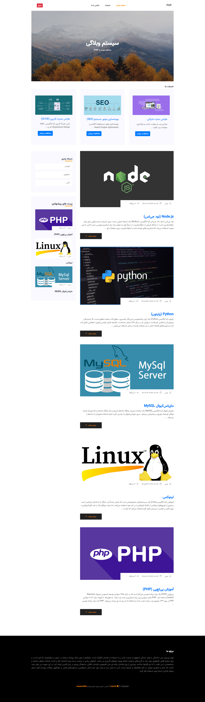
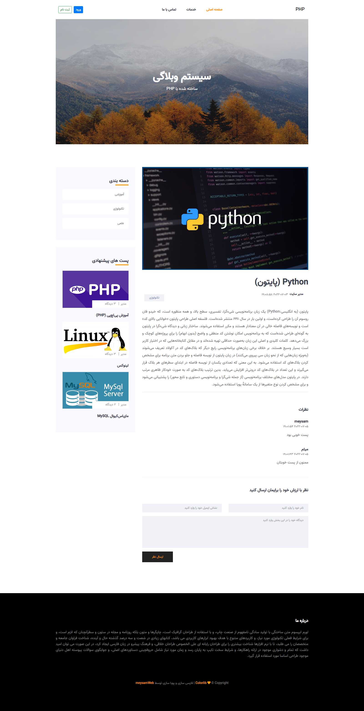

  <h1 align="left">PHP Blog Project - beta version</h1>

This template panel belongs to <a href="https://startbootstrap.com/theme/sb-admin-2" target="_blank">startbootstrap</a> of which the free version is used. and We only made it for RTL languages

This template app belongs to <a href="https://colorlib.com/" target="_blank">Colorlib</a> and We only made it for RTL languages

### **Demo admin panel**

 

<h3>Used</h3>
<pre>
# php 7.4
# mysql 5.X
# bootstrap RTL 4.6
# jquery 3.6.0
# meta tag autocomplete create in page and blog
# login and logout
# register users
</pre>

<h3>other page in admin panel</h3>

**Login Page**

 

**Register Page**

 

**Page Admin**

 

---

### **Demo app index**

 

<h3>Technology used</h3>
<pre>
# HTML 5
# CSS 3
# bootstrap RTL 4.X
# jquery 3.X.X
</pre>

<h3>other page in website</h3>

**Blog Page**

 

---

## Change Log
<pre>
# 2022-06-07
 beta version
 php version 7.4
 bootstrap version 4.6
 mysql version 5
 limited show page in index site(3)
 login & register with authentication
 helper functions
 upload file(image)
 contact form
 comment form
</pre>